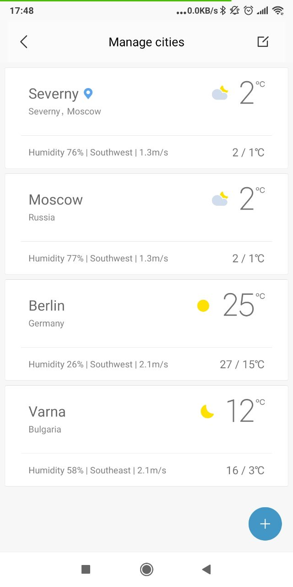
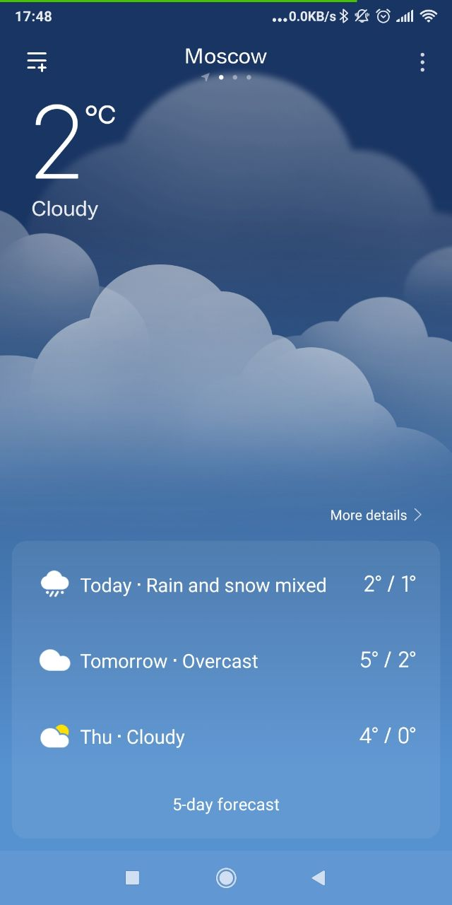

# Экзамен

>Разработать приложение, которое показывает погоду из данных открытых источников.

## Задания и критерии:

- [ ] В корневой папке проекта создать новую папку `./exam`. В ней создать базовое приложение с помощью `React` и [CRA](https://github.com/facebook/create-react-app#quick-overview)
- [ ] Сверстать страницы и необходимые компоненты. Использовать стили
- [ ] Поиск погоды по названию города
- [ ] Выбор погоды по ID из списка доступных
- [ ] Выбор погоды по географическим координатам
- [ ] Использовать `React-router` для перехода между страницами
- [ ] Использовать `Redux` для построения хранилища данных приложения и взаимодействия с ним
- [ ] Задеплоить в решение `Travis CI`.
- [ ] Теория: Объяснить, почему были использованы те или иные инструменты, участки кода и механизмы при решении задачи (выполняется лично с преподавателем)
- [ ] Ревью: получить правки по коду и исправить их (получается лично у преподавателя и выполняется самостоятельно)

## Макеты

* Первый элемент - это текущая геопозиция
* Все последующие элементы - хардкод из списка
* "Парящая" кнопка "+" - это действие "добавить город в список"

* Подробная информация о погоде на 3 дня

[Графика (картинки) для отображения погодных условий](https://openweathermap.org/weather-conditions)

## Информация по API

* Адрес: https://openweathermap.org/current

### `By city name`

Пример запроса: https://samples.openweathermap.org/data/2.5/weather?q=London,uk&appid=b6907d289e10d714a6e88b30761fae22&units=metric

### `By city ID`

Пример запроса: https://samples.openweathermap.org/data/2.5/weather?id=2172797&appid=b6907d289e10d714a6e88b30761fae22&units=metric
Для получения списка `ID` необходимо скачать [json](http://bulk.openweathermap.org/sample/city.list.json.gz), выбрать из него список "избранных" 10 локаций (ID и name) и захардкодить их в приложение.

### `By geographic coordinates`

Пример запроса: https://samples.openweathermap.org/data/2.5/weather?lat=35&lon=139&appid=b6907d289e10d714a6e88b30761fae22&units=metric

## Важно:

* Для сдачи экзамена необходимо создать `PR`, который должен включать в себя только проделанную работу.
* Пользоваться можно всем, чем угодно.
* Задавать вопросы можно и нужно.
* Если сидите над каким-то пунктом более 10 минут, не понимая, что делать - поднимайте руку, поможем.

## Бонус

Если с заданием получается справиться за время экзамена, то вы получаете +2 балла
