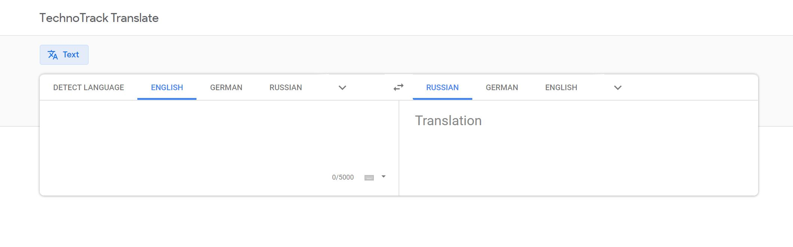

# Экзамен

>Разработать web приложение "переводчик иностранных языков".

## Задания и критерии (каждый пункт === 2 балла):

Код для первого пункта:

```bash
cd <ваш проект>
# 1. сохранить весь текущий прогресс, если такой имеется
# (git stash или git commit && git push)
# 2. Переключаемся в мастер и синхронизируемся с github
git checkout master
git pull origin master
# 3. для избежания проблем при деплое,
# стоит заранее удалить папку node_modules и файл package-lock.json
rm -rf node_modules && rm package-lock.json && npm i
# 4. создать новый проект от master ветки в новой ветке
git checkout -b exam_2
npx create-react-app exam_2 --template typescript
```

Для разработки приложения необходимо использовать модуль, разработанный в рамках `ДЗ6` (TS1)

- [ ] В корневой папке проекта создать базовое приложение `exam_2` с помощью [CRA](https://github.com/facebook/create-react-app#quick-overview) по инструкции выше
- [ ] Использовать `TypeScript`
- [ ] Сверстать страницу и необходимые компоненты. Использовать стили
- [ ] Перевод с одного языка на другой (будет бонусом, если будет можно выбрать язык из выпадающего списка)
- [ ] Перевод с неизвестного языка (автоопределитель из `API`)
- [ ] Manifest для `PWA` для `Splash screen` на мобильном устройстве [статья](https://medium.com/@applification/progressive-web-app-splash-screens-80340b45d210)
- [ ] Обернуть приложение в `docker` (чтобы запускалось локально в нем)
- [ ] Задеплоить в решение `Travis CI`.
- [ ] Теория: Объяснить, почему были использованы те или иные инструменты, участки кода и механизмы при решении задачи (выполняется лично с преподавателем)
- [ ] Ревью: получить правки по коду и исправить их (получается лично у преподавателя и выполняется самостоятельно)

## Макет

### Главная страница


## Важно:

* Для сдачи экзамена необходимо создать `PR`, который должен включать в себя **только** проделанную работу.
В теле `PR` нужно указать эти 10 критериев, чтобы было удобнее оценивать работу
* Пользоваться можно всем, чем угодно.
* Задавать вопросы можно и нужно.
* Если сидите над каким-то пунктом более 10 минут, не понимая, что делать - поднимайте руку, поможем.

## Бонус

Если с заданием получается справиться за время экзамена, то вы получаете +2 балла
