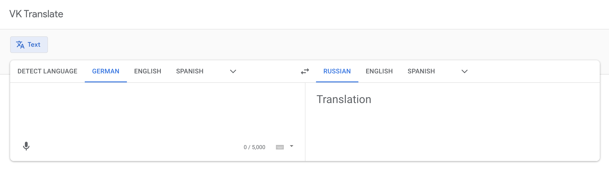
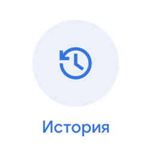
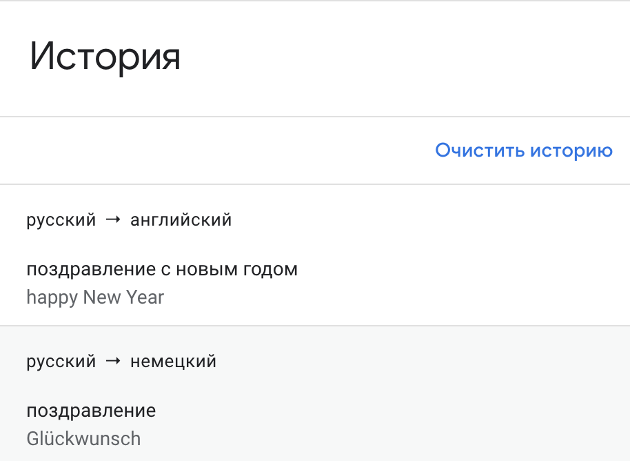

# Экзамен

>Разработать web приложение "переводчик иностранных языков".

## Задание и критерии (каждый пункт === 4 балла):

Код для первого пункта:

```bash
cd <ваш проект>
# 1. сохранить весь текущий прогресс, если такой имеется
# (git stash или git commit && git push)
# 2. Переключаемся в мастер и синхронизируемся с github
git checkout master
git pull origin master
# 3. создаём новый проект от master ветки в новой ветке
git checkout -b exam
npx create-react-app exam
# (Bonus level*) Если хотите сделать работу на TypeScript
npx create-react-app exam --template typescript
```

Для разработки приложения необходимо использовать модуль, разработанный в рамках [`ДЗ12`](../lesson_12/homework.md).
Если ДЗ не выполнено, то ничего страшного, просто придется реализовать работу с API в рамках текущего задания (см. более подробную информацию об API в ДЗ12)

- [ ] В корневой папке репозитория создать базовое приложение `exam` с помощью [CRA](https://github.com/facebook/create-react-app#quick-overview) по инструкции выше
- [ ] Сверстать 2 страницы и необходимые компоненты. Использовать стили
- [ ] Реализовать перевод с одного языка на другой (хорошо, если можно будет выбрать язык из выпадающего списка)
- [ ] Реализовать перевод с неизвестного языка (автоопределитель из `API`)
- [ ] Сохранять историю переводов в `localStorage`
- [ ] Использовать `Redux`
- [ ] Использовать `React-router` для перехода между страницами
- [ ] Задеплоить решение, используя `GitHub Actions`.
- [ ] Теория: Объяснить, почему были использованы те или иные инструменты, участки кода и механизмы при решении задачи. Ответить на теоретические вопросы (пункт выполняется лично с преподавателем)
- [ ] Ревью: получить правки по коду и исправить их (получаются лично у преподавателя и выполняются самостоятельно)

## Примерные макеты

### Главная страница



На главной странице есть форма для ввода переводимой фразы, окно с результатом.

Интерфейс позволяет выбрать из списка текущий и целевой языки.



В интерфейсе должна быть кнопка для перехода на страницу с историей переводов

### История



На странице истории есть возможность прочитать предыдущие переводы и очистить историю.

## Информация по API

* Скоро появится

## Важно:

* Для сдачи экзамена необходимо создать `PR`, который должен включать в себя **только** проделанную работу.
В теле `PR` нужно указать эти 10 критериев (скопировать), чтобы было удобнее оценивать работу.
* Пользоваться можно всем, чем угодно.
* Задавать вопросы можно и нужно.
* Если мы заметим, что код был у кого-то списан, максимальный балл за работу будет равен 0.
* Если сидите над каким-то пунктом более 10 минут, не понимая, что делать - спрашивайте, поможем.

## Бонус

Если выполнить задание с использованием `TypeScript`, вы сможете получить дополнительные баллы (Размер определяется индивидуально)
