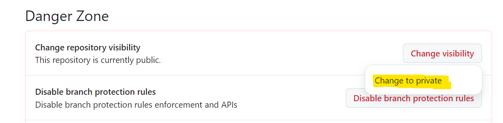

# Домашнее задание 3: Рефакторинг и подготовка к React

## Ознакомиться с материалом

- Просмотреть скринкаст в режиме скорости x2 и переварить то, что было пройдено

## Обязательное дополнительное задание

Нужно перевести свой репозиторий в приватный режим.

Открыть настройки репозитория, проскроллить в самый низ и выбрать данную опцию:

## Задание

Небходимо реализовать новый экран чата приложения Messenger.

* Рассмотреть экран списка чатов в [макете](https://scene.zeplin.io/project/5b9a4b6aae5aa72171a8e5cf/screen/5b9a4b805661fbb6ac3f3882)

  
Посмотреть макет

  

* Декомпозировать макет на маленькие части. Должны получиться примерно следующие компоненты:
  * Шапка (с кнопкой поиска, заголовком, кнопкой "бургер")
  * Чат (с аватаром, заголовком, последним сообщением, временем и индикатором прочитанности/доставленности)
  * "Парящая" кнопка "создать чат"
* Заверстать страницу, максимально разбив свой код компонентов (js/css) на разные файлы
* Предусмотреть переходы с экрана списка чатов на экран сообщений, который был реализован в предыдущем ДЗ
* По возможности использовать новые возможности языка `JS`, где это целесообразно

## Срок: до 10 октября (включительно)

ДЗ должно соответствовать критериям из [инструкции](https://github.com/education-vk-company/homework#9-%D0%BF%D1%80%D0%B0%D0%B2%D0%B8%D0%BB%D0%B0-%D1%81%D0%B4%D0%B0%D1%87%D0%B8-%D0%B4%D0%B7).

При сдаче ДЗ необходимо убедиться, что у вас без ошибок выполняется команда `npm run build`.

После создания пулл реквеста у вас проходит сборка проекта в `Github Actions`.

Необходимо проверить, что всё необходимое задеплоилось корректно и готово к проверке.
